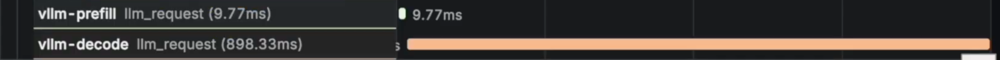
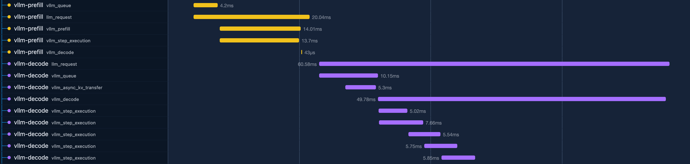
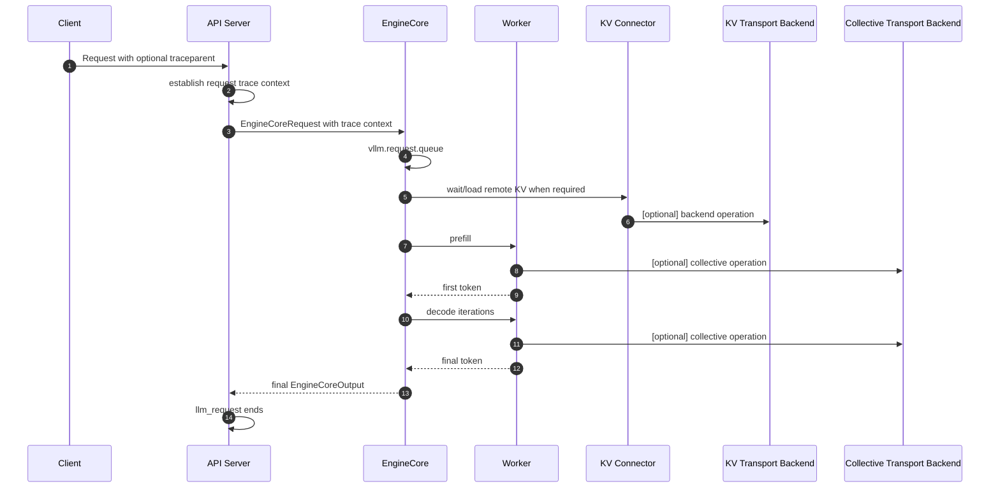

# Tracing

# **Introduction**

vLLM's distributed tracing is designed to provide a granular explanation of a request's lifetime as it travels through the system's frontend, EngineCore, workers, and distributed communication backends. Unlike aggregate metrics that focus on system health and throughput, distributed tracing focuses on the specific timeline of individual requests—breaking them down into phases like queueing, KV transfer, prefill, and decode. This level of detail is critical for debugging performance outliers, as it allows developers to pinpoint exactly which process, rank, or transport operation contributed to unexpected latency.

Current distributed tracing implementations record pre-defined metrics—including time in queue and time to first token—as span attributes. Although beneficial, this method fails to capture the exact start and end time of specific operations like prefill computation or KV cache transfers. Access to this granular data is essential for identifying and addressing performance bottlenecks within the system.

This document proposes an incremental design for request lifecycle tracing in vLLM. The first implementation phases should stay small and low overhead. The longer-term direction is to make a vLLM trace useful for debugging disaggregated serving and distributed transport stalls, along with allowing lower-level transport libraries to also be correlated with each request through trace context.

## **Objectives**

* Deliver a granular, sequential timeline of a request's lifetime as it travels through the vLLM stack (Frontend, EngineCore, Workers) to debug performance outliers.  
  * Currently, vLLM emits a flat \`llm\_request\` span upon request completion (like shown in figure 1). Our goal is to transition it into a hierarchical set of spans so the “journey of a request” can be reconstructed (figure 2)  
* Keep tracing bookkeeping close to zero cost on the critical engine path when disabled, and minimal when enabled.  
* Provide a viable path to carry trace contexts across process and network boundaries, allowing lower-level transport telemetry (e.g., NIXL, NCCL) to correlate with requests.

*Figure 1: The `llm_request` spans that vLLM emits in a prefill / decode disaggregated setup*

*Figure 2: Spans breaking down request lifetime with [PR \#44402](https://github.com/vllm-project/vllm/pull/44402), phases like queuing, kv transfer, and forward passes becomes separate spans*

## **Projected Use Case**

**Troubleshoot Request Tail Latency and Performance Bottlenecks:** In complex serving environments, diagnosing why a specific request experienced high latency can be exceptionally difficult because delays can originate from different subsystems. This proposal provides a unified, high-fidelity chronological timeline to reconstruct a request's journey and pinpoint which specific bottleneck contributed to the tail latency.

Specifically, it allows developers to isolate and identify:

* **Scheduling and Preemption Overhead:** For requests that undergo multiple scheduling, preemption, and re-queueing cycles, tracing visualizes the exact chronological order and severity of these interruptions.  
* **Distributed Execution Stalls:** In multi-node deployments, granular tracing allows developers to pinpoint exactly which process, rank, or transport operation contributed to unexpected latency.  
* **Disaggregated Serving and Network Delays:** When a request waits for remote KV caches, trace contexts propagate across network boundaries. This provides a path for lower-level transport backends such as NIXL, NCCL, and TPU transport paths to correlate operations with request traces.

## **Background**

### **Existing OpenTelemetry support**

vLLM has basic OpenTelemetry tracing support today. The basic open telemetry integration was introduced by [PR\#4687](https://github.com/vllm-project/vllm/pull/4687), and the tracing support is later added by [PR \#20372](https://github.com/vllm-project/vllm/pull/20372).

Currently, the tracing implementation supports the following:

* The tracing can be enabled with `--otlp-traces-endpoint` and `--collect-detailed-traces`  
* Incoming W3C trace headers, `traceparent` and `tracestate`, are extracted from API requests and carried into engine requests.  
* Worker processes can initialize OpenTelemetry exporters from inherited tracing configuration.  
* Emits an `llm_request` span when a request finishes.  
* Detailed breakdown for model forward, scheduler and sampler time are included as span attributes, as introduced by [PR \#7089](https://github.com/vllm-project/vllm/pull/7089)

The existing `llm_request` span is useful, but it is mostly a summary span. It is created at request completion and includes request-level timing attributes such as queue time, time to first token, prefill time, decode time, inference time, and end-to-end latency.

The current design has two limitations:

1. **Lack of timeline visualization:**  It does not show the request lifecycle as a timeline. Queueing, KV transfer, prefill, decode, and preemption are represented as attributes rather than as spans with their own start time, end time, status, and attributes.  
2. **No path for low-level telemetry correlation:** It does not naturally correlate lower-level distributed work, such as KV transfer or backend communication, with the request that caused it.

### **Related work**

The [OpenTelemetry Tracing project board](https://github.com/orgs/vllm-project/projects/55) tracks several related efforts. This design does not attempt to cover every tracing-related item on that board. The most relevant active work is:

* Request lifecycle span prototype: [PR \#44402](https://github.com/vllm-project/vllm/pull/44402).
* Trace context propagation and root-span relationships: [PR \#39905](https://github.com/vllm-project/vllm/pull/39905) and [PR \#43005](https://github.com/vllm-project/vllm/pull/43005).
* Token-level tracing: [PR \#32573](https://github.com/vllm-project/vllm/pull/32573).

PR \#44402 is the closest prototype for the request lifecycle span direction, but the initial implementation should still be evaluated independently. In particular, batch-step and per-forward-pass spans should remain separate or detailed-mode work because they have different overhead and span volume tradeoffs.

## **Current Request Timing Model**

V1 currently records request timing information from two places:

* Frontend wall-clock time, such as request `arrival_time`.  
* EngineCore monotonic timestamps, such as `QUEUED`, `SCHEDULED`, `PREEMPTED`, and new-token timestamps.

This works well for metrics because intervals are calculated by comparing timestamps from the same process. However, OpenTelemetry spans require wall-clock timestamps, expressed as nanoseconds since UNIX epoch. A tracing design should therefore avoid blindly converting all existing monotonic timestamps into span timestamps.

There are two viable approaches:

1. Emit spans in the process where the phase begins and ends, using that process's wall clock to span timestamps.  
2. If a frontend process creates spans from EngineCore events, ship enough clock-anchor information to convert EngineCore monotonic timestamps to approximate wall-clock timestamps.

The first approach is simpler and more accurate for new instrumentation, but it requires trace context to be available in the process that emits the span. The second approach minimizes the number of exporters and otel span operations but risks timestamp inaccuracies if clocks and conversion points are not handled carefully. It also requires more data to be stored and sent from EngineCore to frontend.

Therefore, we propose to use the first approach and emit spans in the process where the phase begins and ends, using that process's wall clock to span timestamps. However, because vLLM V1 maintains strict performance requirements on the critical EngineCore loop, this preference is conditional on empirical verification: **we prefer live span creation unless performance benchmarking demonstrates measurable throughput regression or CPU overhead on the engine critical path.**

## **Proposed Span Model**

The existing `llm_request` span should remain the request summary span and the entry point for the vLLM request within a trace. The current implementation already records most of the request summary metadata on this span, including request id, token counts, sampling parameters, and summary latencies. It should continue to carry stable summary attributes, and can be extended with additional bounded attributes that are useful in trace search and overview pages:

* request id  
* model name, when available  
* prompt token count  
* completion token count  
* request parameters such as `temperature`, `top_p`, and `max_tokens`  
* summary latencies such as TTFT and end-to-end latency  
* finish reason and error status, when available

New lifecycle spans should be correlated with `llm_request`, either by making them children of `llm_request` or by placing them in the same trace using the incoming or internally-created trace context. When lifecycle spans are emitted before `llm_request` is exported, a collector or tracing backend can still accept them even if the exact parent span is not present yet. However, if the desired trace shape is strict parent/child nesting under `llm_request`, the implementation must make the `llm_request` span context available before those child spans are created. An alternative implementation can continue to emit spans at request completion from collected timing events, but should then handle timestamp conversion explicitly as described above.

Initial span names:

* `vllm.request.queue`  
* `vllm.request.prefill`  
* `vllm.request.decode`  
* `vllm.request.wait_remote_kv`

Future or detailed-mode span names:

* `vllm.engine.step`  
* `vllm.worker.execute_model`  
* `vllm.model.forward`  
* `vllm.kv_transfer.send`  
* `vllm.kv_transfer.recv`  
* `vllm.transport.nixl`  
* `vllm.transport.nccl`  
* `vllm.transport.tpu`

### **Request lifecycle**

The diagram is conceptual. The implementation may emit some spans from the frontend and some from EngineCore or workers, depending on where accurate timestamps and parent context are available.

### **Batch-level spans and span links**

Some vLLM work is request-scoped, but some work is batch-scoped. A single EngineCore step, model execution, or collective operation can serve many requests at once. Modeling all batch work as a child span under one request would be misleading.

For batch-level work, the design should prefer one of these strategies:

1. Create a batch span and link it to the affected request spans via [Span Links](https://opentelemetry.io/docs/concepts/signals/traces/#span-links).  
2. Emit detailed per-request child spans only in an opt-in detailed mode.  
3. Keep the information as aggregate metrics if span volume or semantics are not suitable for tracing.

`vllm.engine.step` should therefore be detailed-mode or link-based, not a default child span emitted once per request per step.

## **Implementation Plan**

### **Phase 1: request lifecycle spans**

As the first step, we propose adding a small number of low-cardinality lifecycle spans:

* Keep `llm_request` as the request summary span.  
* Add `vllm.request.queue`.  
* Add `vllm.request.prefill`.  
* Add `vllm.request.decode`.  
* Add `vllm.request.wait_remote_kv` only when a request transitions into `WAITING_FOR_REMOTE_KVS`.  
* Add tests using the existing fake OpenTelemetry collector.  
* Keep span emission behind existing tracing configuration.

In this phase, our main focus is on the request lifecycle breakdown. It should not require lower-level transport instrumentation.

[PR \#44402](https://github.com/vllm-project/vllm/pull/44402) is an example of this phase, excluding the batch step span.

### **Phase 2: KV transfer and disaggregated serving**

Once basic lifecycle spans are implemented, add more precise spans for disaggregated prefill/decode and connector behavior:

* backend information, such as the KV connector type  
* connector-side failures, retries, and aborts  
* transferred token and byte counts

This phase may require changes to the existing KV connector interface. For example, a new argument may be needed to propagate the request trace context or parent span context into the KV connector.

### **Phase 3: batch and engine-step correlation**

Add optional detailed tracing for batch-level work:

* EngineCore step  
* worker model execution  
* model forward  
* sampling or postprocessing work when useful

Because this can produce a large number of spans, it should be enabled only through one of:

* A global detailed-tracing configuration.  
* Configurable sampling that enables it on a small portion of requests.  
* A special HTTP header on the request (for example, `X-vllm-verbose-tracing`), only when explicitly enabled by server configuration. This option is open to discussion because request-controlled verbose tracing is useful for debugging a deployed system, but can increase per-request overhead and needs more discussion around security, authorization, and abuse prevention.

Batch-level spans should use span links when one span corresponds to work shared by many request spans.

### **Future direction: lower-level transport context propagation**

As a longer-term direction, we propose preserving trace context at the call sites and wrappers that invoke lower-level transport backends:

* NIXL  
* vLLM NCCL wrapper paths  
* TPU transport backend

This does not require NIXL, NCCL, or TPU transport libraries to support tracing today. Instead, it keeps vLLM's internal interfaces ready to pass trace context or correlation metadata through when those backends expose tracing-aware APIs.

Not every backend will be able to carry a full OpenTelemetry context. Depending on the backend, vLLM may use one of the following:

* parent span context passed to the vLLM wrapper or call site  
* span links

## **Attribute Guidelines**

Span attributes should be useful for filtering and debugging, but must avoid unbounded cardinality and sensitive data. Attribute names should be chosen in this order:

1. Use OpenTelemetry GenAI semantic convention attributes when they describe the data accurately.  
2. Preserve existing vLLM tracing attributes for compatibility.  
3. Add `vllm.` custom attributes only for vLLM-specific concepts that do not have a suitable OpenTelemetry convention.

OpenTelemetry GenAI semantic conventions include attributes such as:

* `gen_ai.request.max_tokens`  
* `gen_ai.request.temperature`  
* `gen_ai.request.top_p`  
* `gen_ai.request.model`  
* `gen_ai.response.model`  
* `gen_ai.response.finish_reasons`  
* `gen_ai.usage.input_tokens`  
* `gen_ai.usage.output_tokens`

Existing vLLM tracing attributes include older token names and vLLM-specific latency attributes, for example:

* `gen_ai.request.id`  
* `gen_ai.usage.prompt_tokens`  
* `gen_ai.usage.completion_tokens`  
* `gen_ai.latency.time_in_queue`  
* `gen_ai.latency.time_to_first_token`  
* `gen_ai.latency.e2e`  
* `gen_ai.latency.time_in_model_prefill`  
* `gen_ai.latency.time_in_model_decode`  
* `gen_ai.latency.time_in_model_inference`

For new lifecycle spans, proposed custom attributes should use the `vllm.` *namespace and should remain bounded-cardinality. Examples include:*

* `vllm.kv_transfer.backend`  
* `vllm.kv_transfer.num_blocks`  
* `vllm.kv_transfer.num_tokens`  
* `vllm.rank`  
* `vllm.local_rank`  
* `vllm.pipeline_parallel_rank`  
* `vllm.tensor_parallel_rank`  
* `vllm.data_parallel_rank`

The exact custom attribute names should be finalized as part of the implementation PR.

Attributes to avoid by default:

* prompt text  
* generated text  
* user identifiers  
* full remote addresses  
* per-token values

## **Overhead Guidelines**

Tracing is useful only if it can be enabled safely in realistic deployments. The implementation should follow these rules:

* When tracing is disabled, avoid span objects, attribute dictionaries, and extra timestamp work.  
* Keep lifecycle span count small in default tracing mode.  
* Avoid adding new Python loops over the full batch solely for tracing, as stated in [here](https://github.com/vllm-project/vllm/blob/main/vllm/v1/engine/output_processor.py#L596-L598).  
* Reuse events already produced for metrics when doing so is correct.  
* Keep detailed per-step, per-token, and transport-level spans opt-in.  
* Prefer bounded attributes over high-cardinality labels or span names.

## **Interaction With Existing \`llm\_request\`**

The current `llm_request` span should not be removed. It is useful as the vLLM request summary span and as a compact entry point for trace search. The lifecycle span design should evolve the current behavior:

* `llm_request` remains the request summary span.  
* Existing summary timing attributes can remain for compatibility and search.  
* New lifecycle spans provide the timeline and causal breakdown.  
* Implementations may use strict parent/child relationships or same-trace correlation, depending on where span context is available.  
* Future deprecation of redundant attributes, if any, should follow the same caution used for metric deprecation.

This approach keeps existing users working while improving the value of traces for distributed debugging.

## **Open Questions**

* What is the correct parent/child/link structure for batch-level spans?  
* Which KV transfer events have reliable start and end boundaries today?  
* How should preemption, cancellation, and abort paths close or annotate in-progress lifecycle spans?  
* Should tracing be decoupled from `log_stats` so tracing can be enabled without enabling metrics logging state? Currently in the V1 engine, the tracing implementation unconditionally relies on the request's timing metrics being present.  
* How should detailed tracing modes be exposed in configuration?

## **Initial PR Scope**

The first implementation of PR should be intentionally small. [PR \#44402](https://github.com/vllm-project/vllm/pull/44402) is the current prototype for this direction, but should be treated as related work rather than as the full initial scope.

The first PR should preserve the existing `llm_request` behavior and add only the default request lifecycle spans from Phase 1: queue, remote-KV wait, prefill, and decode. It should include fake-collector coverage for span relationships, basic attributes, and cleanup on normal finish and abort/error paths. It should also explain the tracing-disabled overhead.

Batch-step spans, per-forward-pass spans, detailed KV transfer spans, batch correlation, and lower-level transport context propagation should remain follow-up work unless they are explicitly introduced behind a detailed tracing mode.  